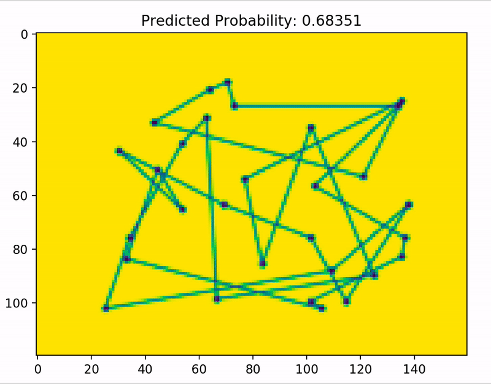

# TSP
Library to hold implementation work for Traveling Salesman Problem research for my senior thesis at Whitman College, May 2020.

# Visual Agents
Convolutional Neural Network models trained to identify optimal TSP tours

